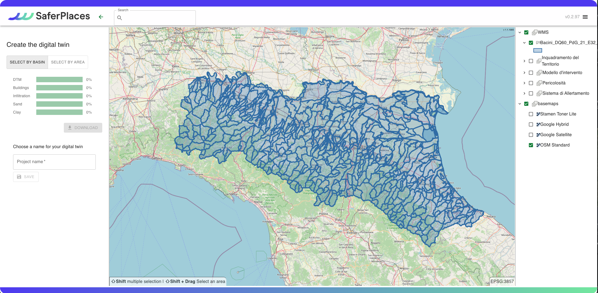

# 💻 Creazione Digital Twin e attivazione del servizio nell'area di interesse - SOLO UTENTI REGIONE ER

Cliccando sull'icona “_Create a project_” (Creare un progetto), l'utente attiva l'interfaccia guidata (Wizard) per l'attivazione del servizio e la generazione della Digital Twin dell'area identificata come di interesse.

<figure><figcaption></figcaption></figure>

Per gli utenti della Protezione Civile della Regione Emilia Romagna che sono stati abilitati la procedura di attivazione del sarvizio Saferplaces segue un wizard semplificato che richiede unicamente la defizioni dell'area di interesse ed automaticamente acquisisce e pre-processa tutti i layer necessari alla generazione della Digital Twin ed alla attivazione del servizio.

<figure><figcaption></figcaption></figure>

L'utente deve esclusivamente definire un area di attiovazione attraverso due modalità:

* Selezione di un area rettangolare - cliccando sul pulsante SELECT BY AREA



* Selezionare uno o più bacini idrografici - cliccando sul pulsante SELECT BY BASIN



Il Wizard automaticamente procede nei cinque passi per scaricare o selezionare  i layers di input che permetteranno attivare il nuovo progetto:

[step-1-dtm-raster-geotiff.md](../creazione-digital-twin-e-attivazione-del-servizio-nellarea-di-interesse/step-1-dtm-raster-geotiff.md "mention") -Modello digitale del terreno (obbligatorio)&#x20;

[step-2-edifici-vettoriale-shapefile.md](../creazione-digital-twin-e-attivazione-del-servizio-nellarea-di-interesse/step-2-edifici-vettoriale-shapefile.md "mention") -  (obbligatorio) &#x20;

[step-3-tasso-di-infiltrazione-raster-geotiff.md](../creazione-digital-twin-e-attivazione-del-servizio-nellarea-di-interesse/step-3-tasso-di-infiltrazione-raster-geotiff.md "mention")&#x20;

[step-4-litologia-raster-geotiff.md](../creazione-digital-twin-e-attivazione-del-servizio-nellarea-di-interesse/step-4-litologia-raster-geotiff.md "mention") Litologia - Raster GeoTiff

[step-5-layer-geospaziali-aggiuntivi-raster-e-vettoriali.md](../creazione-digital-twin-e-attivazione-del-servizio-nellarea-di-interesse/step-5-layer-geospaziali-aggiuntivi-raster-e-vettoriali.md "mention")&#x20;

[step-6-crea-e-finalizza-il-progetto.md](../creazione-digital-twin-e-attivazione-del-servizio-nellarea-di-interesse/step-6-crea-e-finalizza-il-progetto.md "mention")&#x20;


Attivando nei diversi passi l'opzione  _**Upload è possibile caricare layer di propietà dell'utente.**_


&#x20;

<figure><figcaption>
Interfaccia grafica per la creazione del gemello digitale della città
</figcaption></figure>

### Video Esempio di creazione di gemello digitale&#x20;


Esempio di creazione di digital twin (Gemello digitale)

