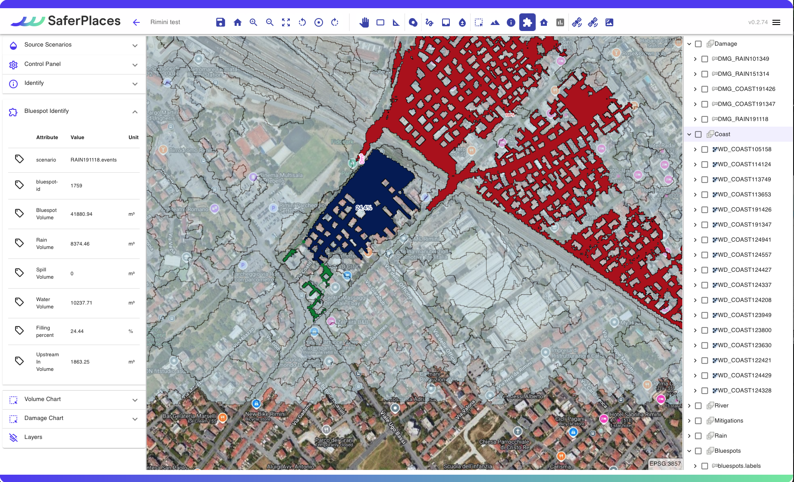
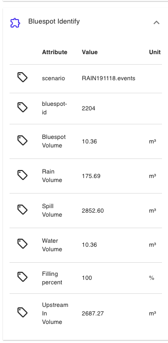

# 🛠️ Visualizzazione dei risultati

In pochi minuti dopo l'esecuzione della simulazione, l'utente può  visualizzare i risultati che consistono in due tipi di layer spaziali:&#x20;

* un layer Raster GeoTiff relativo all'estensione e alla  profondità dell'acqua delle aree allagate (in blu)&#x20;
* un layer Vettoriale ShapeFile relativo al calcolo del  danno economico per ciascun edificio interessato dall'allagamento. Questo layer appare unicamente se si è attivato il calcolo del danno nel Wizard di generazione della simulazione.

I due layer geospaziali sono caricati automaticamente nella [barra-laterale-destra.md](../saferplaces-interfaccia-gui-web/barra-laterale-destra.md "mention"), in categorie specifiche corrispondenti alla loro fonte di pericolo: “_RAINFALL, RIVER, COASTAL_ o _DAMAGE_”.&#x20;

Il nome del Layer generato contiene il nome della simulaizone definito in fase di generazione dello scenario con davanti i suffissi:

* WD\_ Nel caso dei layer di allagamento
* DMG\_ Nel caso dei layer di Danno Economico


Gli output generati possono essere scaricati come file raster Geotiff oppure come vettoriale shapefile semplicemente cliccando con il tasto destro sul layer di interesse e poi su "_Export_" (Esporta).


&#x20;Inoltre i seguenti  strumenti disponibili nella [barra-superiore.md](../saferplaces-interfaccia-gui-web/barra-superiore.md "mention") aiutano a esaminare i risultati ottenuti:&#x20;

Section  - Sezione Trasversale

.png>)

lo strumento "_Section_" consente di ottenere facilmente la profondità dell'acqua per una sezione specifica, semplicemente tracciando una linea su qualsiasi layer di profondità dell'acqua. Nella parte inferiore dello schermo si apre una nuova finestra in cui viene visualizzata la sezione trasversale dell'area selezionata.

.png>)

“<em>Identify</em> " 

.png>)

Lo Strumento “_Identify_ " (Identifica), presente nella [barra-superiore.md](../saferplaces-interfaccia-gui-web/barra-superiore.md "mention") permette di visualizzare le informazioni in corrispondenza di un punto di interrogazione per i layer geospaziali attivi sulla [barra-laterale-destra.md](../saferplaces-interfaccia-gui-web/barra-laterale-destra.md "mention")

Il valore che si può visualizzare è ralitivo alla profondità dell'acqua per il layer di allagamento attivo e/o il danno economico per l'edificio selezionato relativamente ai layer di danno economico attivi.

I risultati di questo strumento appariranno nel corrispondente pannello delle attività sulla sinistra.

"<em>Bluespots</em>" 

.png>)

Lo strumento "_Bluespots_" è un tool di analisi specifica dei risultati relativi a [simulazione-allagamento-pluviale.md](../simulazioni-allagamento-pericolo-e-danno/definizione-scenario-source-scenarios/simulazione-allagamento-pluviale.md "mention") ottenute dal modello [safer\_rain.md](../simulazioni-allagamento-pericolo-e-danno/modelli-di-allagamento-hazard-saferplaces/safer\_rain.md "mention").&#x20;

Esso è presente  nella [barra-superiore.md](../saferplaces-interfaccia-gui-web/barra-superiore.md "mention") ed una volta attivato richiede di selezionare nel menu a tendina il  [#nome-simulazione](../simulazioni-allagamento-pericolo-e-danno/definizione-scenario-source-scenarios/simulazione-allagamento-costiero.md#nome-simulazione "mention")per la [simulazione-allagamento-pluviale.md](../simulazioni-allagamento-pericolo-e-danno/definizione-scenario-source-scenarios/simulazione-allagamento-pluviale.md "mention") in cui si vuole procedere nell'analisi.

Una volta attivato, si accenderanno automaticamente nella [barra-laterale-sinistra.md](../saferplaces-interfaccia-gui-web/barra-laterale-sinistra.md "mention")i layers del gruppo [#bluespots](visualizzazione-dei-risultati.md#bluespots "mention"), muovendosi con il mouse nei diversi sotto-bacini si attiveranno nella [barra-laterale-destra.md](../saferplaces-interfaccia-gui-web/barra-laterale-destra.md "mention")una specifica finestra con le singole voci del bilancio di massa del sotto-bacino in esame, mentre nella mappa verranno evidenziati i seguenti sotto-bacini:

* i bacini (VERDE) che afferiscono volume verso il bluespot in esame (BLUE)
* i bacini (ROSSO) che riceveono volume dal bacino in esame (BLUE)

Nella [barra-laterale-sinistra.md](../saferplaces-interfaccia-gui-web/barra-laterale-sinistra.md "mention")le voci del bilancio idrologico sono le seguenti:

* Scenario= [#nome-simulazione](../simulazioni-allagamento-pericolo-e-danno/definizione-scenario-source-scenarios/simulazione-allagamento-pluviale.md#nome-simulazione "mention") dello scenario di [simulazione-allagamento-pluviale.md](../simulazioni-allagamento-pericolo-e-danno/definizione-scenario-source-scenarios/simulazione-allagamento-pluviale.md "mention")
* bluespot-d= identificativo del sotto bacino/depressione
* Bluespot Volume = Volume in mc della depressione vuota
* Rain Volume = Volume di acqua che riempie la depressione per la pioggia
* Spill Volume = Volume in mc di acqua che riempie i sotto-bacino di valle (ROSSO) in caso di overspill ovvero troppo pieno
* Water Volume = Volume di acqua in mc presente nella depressione, questo valore è sempre minore uguale di Bluespot Volume
* Filling Percent % = percentuale di riempimento della depressione
* UpStream IN Volume = volume di acqua in mc che arriva dalle depressioni di monte (VERDE) che per troppo pieno (overspill) scaricano sulla depressione in esame

"<em>Volume Chart</em>” e “<em>Damage Chart</em>”

.png>)

Nella [barra-superiore.md](../saferplaces-interfaccia-gui-web/barra-superiore.md "mention") sono presenti due strumenti dedicati per interrogare sia i layer di allagamento che di danno economico mediante uno strumento di selezione areale (poligono).

Questi strumenti denominati rispettivamente  “_Volume Chart_” e “_Damage Chart_” riportano una statistica dei valori di allagamento e danno compresi nel poligono di selezione generato dall'utente.

Una volta attivato il pulsante, l'utente tendo premuto il tasto destro del mause può disegnare un poligono a mano libera.

Nella [barra-laterale-sinistra.md](../saferplaces-interfaccia-gui-web/barra-laterale-sinistra.md "mention") si attiva un task di viuslizzazzione che riporta due o più istrogrammi relativi ai layer di allagamento o danno attivati sulla [barra-laterale-destra.md](../saferplaces-interfaccia-gui-web/barra-laterale-destra.md "mention").

ATTENZIONE - Attivare sempre un layer oggetto dell'analisi altrimenti non si visualizzano istrogrammi.

.png>)

.png>)

## Esempio di visualizzazione dei risultati di una simulazione

@inserire video\
\
@@ESPORTAZIONE DEI RISULTATI\
@@VISUALIZZAZIONE DELLA LEGENDA



