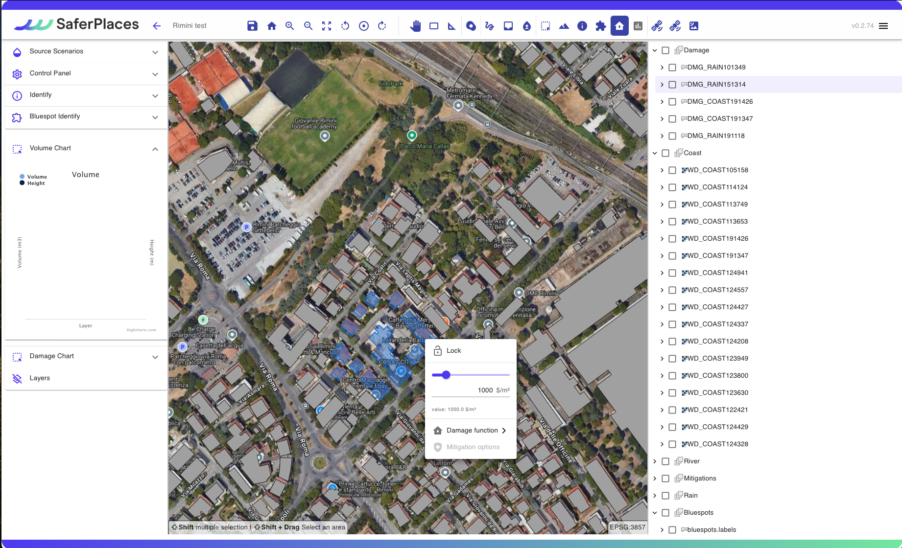
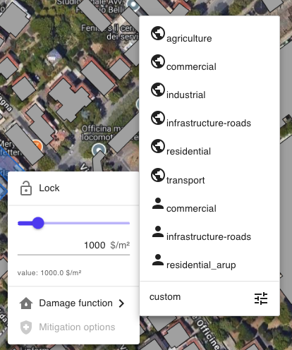

# Barra superiore

Nella barra superiore sono presenti molti strumenti, come mostrato nella figura sottostante e descritti in tabella.

<figure><figcaption>
Strumenti della barra superiore
</figcaption></figure>

strumenti di navigazione mappa

in alto a sinistra sono presenti alcuni strumenti di base, in ordine da sinistra verso destra sono presenti:

* tasto per salvare l'avanzamento del progetto,&#x20;
* ritorno all'ultima posizione salvata,&#x20;
* zoom in,&#x20;
* zoom out,&#x20;
* schermo intero,&#x20;
* rotazioni antiorarie,&#x20;
* azzeramento delle rotazioni,&#x20;
* rotazioni orarie&#x20;
* pannello per spostarsi,&#x20;
* zoom per selezionare,&#x20;
* righello per misurare.

strumenti specifici per le simulazioni di allagamento

* Strumento denominato “_Rain”_ per disegnare e localizzare un evento pluviometrico in corrispondenza di una sotto-area all'interno del dominio [#definizione-e-caratterizzazione-dellevento-pluviale-pluvial-scenario-1-rain](../simulazioni-allagamento-pericolo-e-danno/definizione-scenario-source-scenarios/simulazione-allagamento-pluviale.md#definizione-e-caratterizzazione-dellevento-pluviale-pluvial-scenario-1-rain "mention") ( [simulazione-allagamento-pluviale.md](../simulazioni-allagamento-pericolo-e-danno/definizione-scenario-source-scenarios/simulazione-allagamento-pluviale.md "mention"))
* strumento denominato _“Draw_ _Barrier”,_ per disegnare e localizzare barriere fisiche come azioni di mitogazione [#barriere-fisiche-3-barriers](../simulazioni-allagamento-pericolo-e-danno/definizione-scenario-source-scenarios/simulazione-allagamento-costiero.md#barriere-fisiche-3-barriers "mention") ( [misure-di-mitigazione-del-rischio-di-alluvione.md](../misure-di-mitigazione/misure-di-mitigazione-del-rischio-di-alluvione.md "mention"))
* strumento denominato _“Draw storage tank”,_ per disegnare opzioni di mitigazione come una cisterna/serbatoio d'acqua ( [misure-di-mitigazione-del-rischio-di-alluvione.md](../misure-di-mitigazione/misure-di-mitigazione-del-rischio-di-alluvione.md "mention"))
* strumento denominato _“Infiltration Rate”,_ per modificare il tasso di infiltrazione del terreno. ( [misure-di-mitigazione-del-rischio-di-alluvione.md](../misure-di-mitigazione/misure-di-mitigazione-del-rischio-di-alluvione.md "mention"))

strumenti per analisi dei risultati delle simulazioni

In questo gruppo sono presenti alcuni tools per l'analisi dei irsultati generati dalle simulazioni di allgamento e calcolo del danno economico.

Una descrizione dettagliata è presente in [visualizzazione-dei-risultati.md](../risultati/visualizzazione-dei-risultati.md "mention")

* Volume/Danno  [#volume-chart-e-damage-chart](../risultati/visualizzazione-dei-risultati.md#volume-chart-e-damage-chart "mention")
* Sezione  [#section-sezione-trasversale](../risultati/visualizzazione-dei-risultati.md#section-sezione-trasversale "mention")
* Identificazione  [#identify](../risultati/visualizzazione-dei-risultati.md#identify "mention")
* Analisi e bilancio idrico dei [#bluespots](../risultati/visualizzazione-dei-risultati.md#bluespots "mention")

Si veda il capitolo sui risultati ( [Broken link](broken-reference "mention")) per maggiori approfondimenti sulla funzione dei singoli strumenti.&#x20;

strumento Curve di Danno e Valore Edifici

In questo gruppo si attiva lo sturmento che consente di personalizzare i dati di valore economico e vulnerabilità di ciascun edificio.

Una volta attivato il tool, sulla mappe viene automaticamente visulaizzato il layer degli edifici presente nella Digital Twin.\
Selezionando uno o più edifici (tenendo premuto il tasto destro del mouse è possibile disegnare un poligono di selezione), cliccando con il tasto destro del mouse l'utente attiva una specifica finestra dove:

1. modiifcare il valore (euro/USD) al mq degli edifici selezionati &#x20;
2. assegnare una curva di danno o vulnerabilità degli edifici. La Damage Function può essere scelta tra alcune curve disponibili oppure genrata in base ai dati e preferenze dell'utente.

strumenti di processamento dati satellitari

Infine, lo strumento “_Satellite_” consente all'utente di attivare 3 funzioni satellitari:

* Safer 001
* Safer 002
* Safer 003

Si rimanda al capitolo con la descrizione degli strumenti satellitari per maggiori approfondimenti ( [Broken link](broken-reference "mention"))

