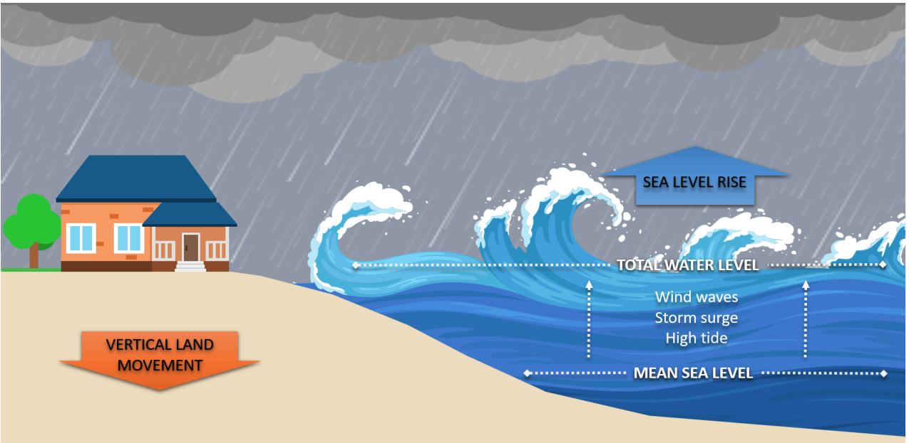
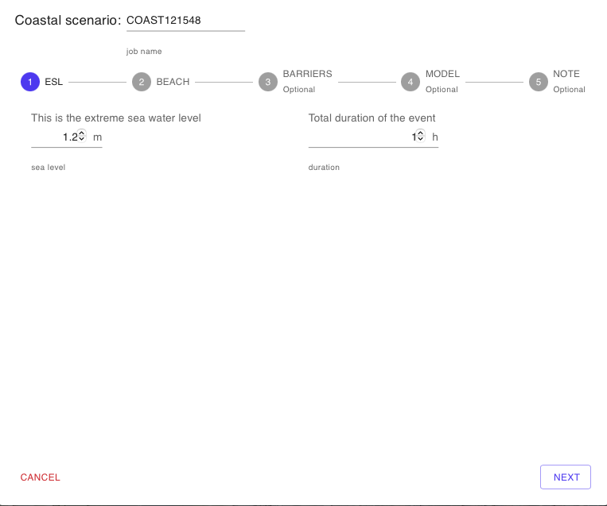
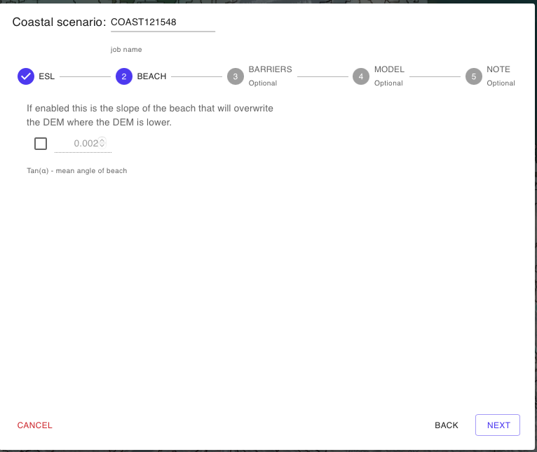
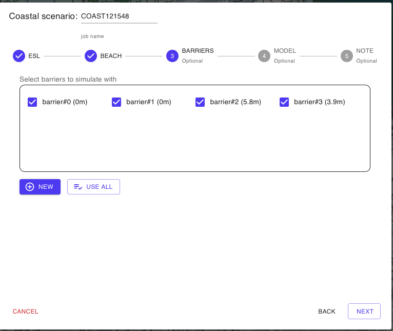

# 🏖️ Simulazione Allagamento Costiero

In questa sezione “_Coastal scenario_” (scenario costiero) l'utente ha  la possibilità di definire e generare uno scenario di allagamento di tipo costiero determinato da uno specifico livello del mare (extreme sea level) in metri ottenuto dalla combinazione dei seguenti elementi:

* Livello di Marea
* Livello da Storm Surge
* Livello da "Wave Run Up"

<figure><figcaption></figcaption></figure>

## COASTAL: -SIMULAZIONE ALLAGAMENTO COSTIERO

La procedura guidata -Wizard si articola nei seguenti step:

Nome Simulazione

L'utente può modificare il nome della simulaizone editando liberamente il nome che viene assegnato automaticamente. Si consiglia di utilizzare un nome composto da caratteri standard e numeri senza uso dello spazio e/o simboli.

Extreme Sea Level (1-ESL)

Il primo step consiste nella definizione del livello del mare ovvero Extreme Sea Level (ESL) in metri, si tratta di una quota definita rispetto al livello del medio mare.\
In aggiunta alla quota in caso si voglia procedere con una simulaizone di modellistica idrodinamica occorre anche definire la durata temporale in ore  del livello ESL che si intende simulare.

Pendenza della spiaggia (2-BEACH)

In questo secondo step, l'utente definisce la pendenzza della spiaggia espressa cone CoTangente dell'angolo (alfa).

Se attivata questa opzione si applicherà l'algoritmo descritto&#x20;

@@aggiungere riferimento@@@

Barriere Fisiche (3-BARRIERS)

In questo step l'utente ha la possibilità di inserire sulla mappa del dominio di calcolo attivato una o più barriere fisiche con l'obiettivo di arginare eventuali scenari di allagamento costiero.

L'attivazione del tool di editing delle barriere fisiche avviene cliccando sul pulsante "NEW", il tool che si  attiverà sarà lo strumento “_Draw Barrier_”, lo stesso presente nella [barra-superiore.md](../../saferplaces-interfaccia-gui-web/barra-superiore.md "mention").

Una volta attivato il tool, l'utente agendo con il tasto destro potra aggiungere una nuova barriera selezionenado il tag NEW dal menu a tendina che appare.

Modello di Calcolo (4-MODEL)

In questa sezione del Wizard l'utente ha la possibilità di&#x20;

1. Selezionare il modello di Allagamento (Hazard)
2. Attivare il calcolo del Dannno Economico (Damage)

I modelli di allagamento Pluviale disponibili sono:&#x20;

[safer\_rain.md](../modelli-di-allagamento-hazard-saferplaces/safer\_rain.md "mention") - Modello Raster-based filling and spilling

[untrim.md](../modelli-di-allagamento-hazard-saferplaces/untrim.md "mention") - Modello Idrodinamico 2D

L'opzione di default è sempre il modello [safer\_rain.md](../modelli-di-allagamento-hazard-saferplaces/safer\_rain.md "mention")

Nel caso si selezioni il modello [untrim.md](../modelli-di-allagamento-hazard-saferplaces/untrim.md "mention") occorre definire i seguenti parametri "Settings" cliccando sul task dedicato.&#x20;

* Slider - Durata della Simulazione in ore (h) -Tmax - Max time of simulation
* Slider - Coefficiente di scabrezza Manning  -Manning Coefficient
* Slider - Cella di calcolo in numero di pixel -nl - The number of pixel for each element side&#x20;
* Slider - Tempo di integrazione numerico  (min) -Delta T - Time simulation step
* Slider - Frequenza Stampa Output  (min) -Ti - Time shoot interval

L'attivazione del modello di calcolo del Danno Economico procede spuntando il check-box "Apply Damage"

Definizione dei parametri del modello di calcolo

@@copiare da pluvial una volta definit

Attivazione Calcolo del Danno Economico - DAMAGE

Nella procedura guidata alla pagina "Model" è possibile attivare il calcolo del danno economico per ciascun edificio inserito.

Il calcolo del Danno Economico viene eseguito in prima analisi applicando le seguenti ipotesi:

1. Tutti gli edifici cono considerati residenziali con un curva di vulnerabilità residenziale
2. Valore dell'edificio pari a 1000 euro/mq

Inserimento metadati e descrizione della simulazione generata (5-NOTE)

Cliccando sul pulsante EDIT l'utente può attivare una casella di testo dove inserire metadati e dettagli descrittivi della simulazione che ha appena creato.Cliccando sul pulsante

RUN SIMULAZIONE

Cliccando sul pulsante RUN l'utente attiva l'esecuzione della simulazione creata.\
Dopo l'avvio sul pannello Control Panel si aggiungerà l'esecuzione del processo attivato con indicazione dello stato di avanzamento.

## Video Aggiunta e Editing Barriere Fisiche



## Esempio di simulazione costiera con SAFER\_COAST



## Esempio di simulazione costiera con BARRIERE


