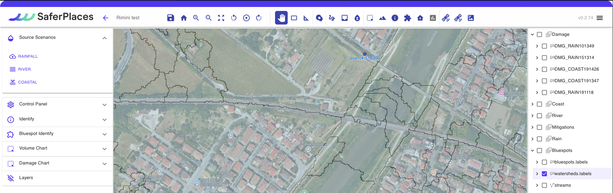
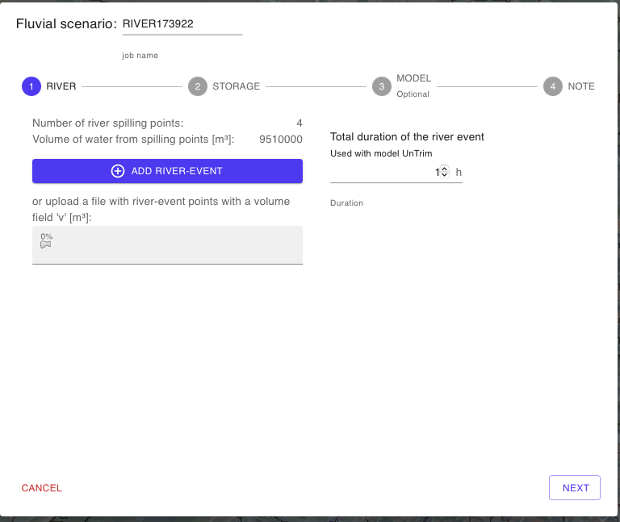
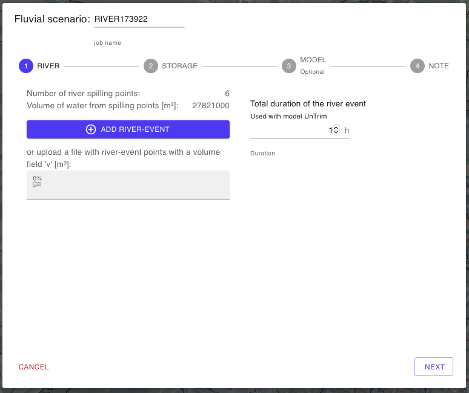
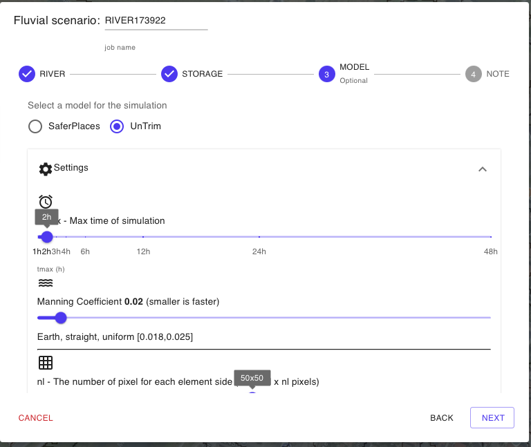
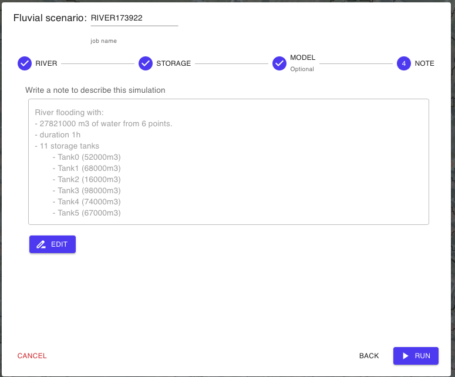

# 💦 Simulazione Allagamento Fluviale

In questa sezione “_Fluvial scenario_” (scenario fluviale) l'utente ha  la possibilità di definire e generare uno scenario di allagamento di tipo fluviale determinato da un rilascio volumetrico, per rottura arginale o sormonto (Overtopping), di una portata o volume di acqua in un determinato intervallo di tempo.

Questi rilasci sono localizzati come Sorgenti Puntiformi e possono essere definiti dall'utente localizzandoli lungo gli Argini dell'asta fluviale oggetto della simulazione.


Nella localizzazione della sorgenti di rilascio volumetrica occorre prestare attenzione ad evitare di collocare il punto sorgente all'interno del sotto-bacino del corso d'acqua. In questo caso l'effetto del rilscio volumetrico andrà ad interessare unicamente l'asta fluviale senza generare allagamento dell'area a valle.

Ai fine di localizzare con precisione il punto di rilascio si consiglia di attivare il layer watershed.labels all'interno gruppo denominato "Bluespots" presente nella [barra-laterale-destra.md](../../saferplaces-interfaccia-gui-web/barra-laterale-destra.md "mention").

Il layer watershed.labels rappresenta la suddivisione del dominio di calcolo in sotto-bacini idrologici (sub-basins)  e consente di capire in quale bacino idrologico il punto di rilascio volumetrico scaricherò la portata di allagamento.



<figure><figcaption></figcaption></figure>

La procedura guidata -Wizard si articola nei seguenti step:

## RIVER: - SIMULAZIONE ALLAGAMENTO FLUVIALE

La procedura guidata -Wizard si articola nei seguenti step:

Nome Simulazione

L'utente può modificare il nome della simulaizone editando liberamente il nome che viene assegnato automaticamente. Si consiglia di utilizzare un nome composto da caratteri standard e numeri senza uso dello spazio e/o simboli.

Definizione e caratterizzazione  dell'evento  Fluviale . "Fluvial Scenario" (1-RIVER)

l primo step 1-RIVER richiede la localizzazione  e caratterizzazione in termini di intensità e durata dell'evento di rilascio fluviale che si intende simulare simulare.

L'utente ha la possibilità di generare e localizzare molteplici eventi di rilascio fluviale, che possono essere determinati da Rottura Arginale o Sormonto Arginale, attraverso l'attivazione del pulsante "ADD RIVER EVENT".

Dopo avere cliccato sul pulsante si attiva il Tool River che permette di definire sulla mappa i punti di rilascio fluviale.&#x20;

L'aggiunta di un nuovo punto avviene cliccando sulla mappa con il tasto destro del Mouse.

* NEW consente di aggiungere un nuovo punto e di definire successivamente il volume di acqua oggetto del rilscio puntuale
* DELETE - Eliminare un singolo punto di rilascio
* CLEAR - Eliminare tutti i punti di rilascio

Dopo avere aggiunto nel dominio di calcolo tutti i punti di rilascio Fluviale, cliccando sul pulsante BACK TO THE WIZARD, si ritorna alla finestra che riporta il numero totale dei punti definiti (che rappresentano le eventuali brecce o sormonti arginali) e il valore cumulato del volume rilasciato da tutti i punti definiti sulla mappa del dominio.

Per tutti i punti generati e il corrispondente volume cumulato  l'utente deve definire la durata del rilascio che verrà utilizzata dal modello idrodinamico UNTRIM.

La DURATA del Rilascio ("Total duration of the river event")  viene definita in ore (h) e rappresenta la durata del rilascio per tutti i punti definiti. Non è possibile definire durate specifiche per ogni punto di rilascio.

Vasche di Accumulo (2-STORAGE)

Come misura di mitigazione dell'hazard la piattaforma SaferPlaces consente all'utente di inserire nel dominio di calcolo delle Vasche di Accumulo (Storage Tanks) che permettono di ridurre il volume di acqua che allaga una specifica area o sotto-bacino del dominio oggetto della simulazione.

Gli Storage Tanks possono essere localizzato come elementi puntiformi mediante l'attivazione dello strumento “_Draw storage tank_”, presente sia nel Wizard che nella  [barra-superiore.md](../../saferplaces-interfaccia-gui-web/barra-superiore.md "mention").

Il tool di generazione delle Storage Tank (Vasche di Accumulo) si attiva cliccando sul Pulsante "NEW" e consente di localizzare le vasche e di associare a ciascuna vasca la capacità volumetrica in mc.

Nel riquadro denominato "Select Storage Tanks to simulate" l'utente ha la possibilità di selezionare e/o rimuvere le Vasche di Accumulo presenti nel dominio. Con il Pulsante "REMOVE ALL" si de-selezionano tutte le vasche presenti.

Modello di Calcolo (3-MODEL)

In questa sezione del Wizard l'utente ha la possibilità di&#x20;

1. Selezionare il modello di Allagamento (Hazard)
2. Attivare il calcolo del Dannno Economico (Damage)

I modelli di allagamento Pluviale disponibili sono:&#x20;

[safer\_rain.md](../modelli-di-allagamento-hazard-saferplaces/safer\_rain.md "mention") - Modello Raster-based filling and spilling

[untrim.md](../modelli-di-allagamento-hazard-saferplaces/untrim.md "mention") - Modello Idrodinamico 2D

L'opzione di default è sempre il modello [safer\_rain.md](../modelli-di-allagamento-hazard-saferplaces/safer\_rain.md "mention")

Nel caso si selezioni il modello [untrim.md](../modelli-di-allagamento-hazard-saferplaces/untrim.md "mention") occorre definire i seguenti parametri "Settings" cliccando sul task dedicato.&#x20;

* Slider - Durata della Simulazione in ore (h) -Tmax - Max time of simulation
* Slider - Coefficiente di scabrezza Manning  -Manning Coefficient
* Slider - Cella di calcolo in numero di pixel -nl - The number of pixel for each element side&#x20;
* Slider - Tempo di integrazione numerico  (min) -Delta T - Time simulation step
* Slider - Frequenza Stampa Output  (min) -Ti - Time shoot interval

L'attivazione del modello di calcolo del Danno Economico procede spuntando il check-box "Apply Damage"

Definizione dei parametri del modello di calcolo

@@copiare da pluvial una volta definito

Attivazione Calcolo del Danno Economico - DAMAGE

Nella procedura guidata alla pagina "Model" è possibile attivare il calcolo del danno economico per ciascun edificio inserito.

Il calcolo del Danno Economico viene eseguito in prima analisi applicando le seguenti ipotesi:

1. Tutti gli edifici cono considerati residenziali con un curva di vulnerabilità residenziale
2. Valore dell'edificio pari a 1000 euro/mq

\

Inserimento metadati e descrizione della simulazione generata (4-NOTE)

Cliccando sul pulsante EDIT l'utente può attivare una casella di testo dove inserire metadati e dettagli descrittivi della simulazione che ha appena creato.Cliccando sul pulsante

\

RUN SIMULAZIONE

Cliccando sul pulsante RUN l'utente attiva l'esecuzione della simulazione creata.\
Dopo l'avvio sul pannello Control Panel si aggiungerà l'esecuzione del processo attivato con indicazione dello stato di avanzamento.

\

## Video Inserimento Punti di Rilascio Fluviale



## Video Inserimento Vasche di Accumulo



## Esempio di simulazione fluviale con modello SAFER



## Esempio di simulazione fluviale con modello UNTRIM

@inserire video
