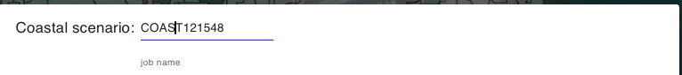
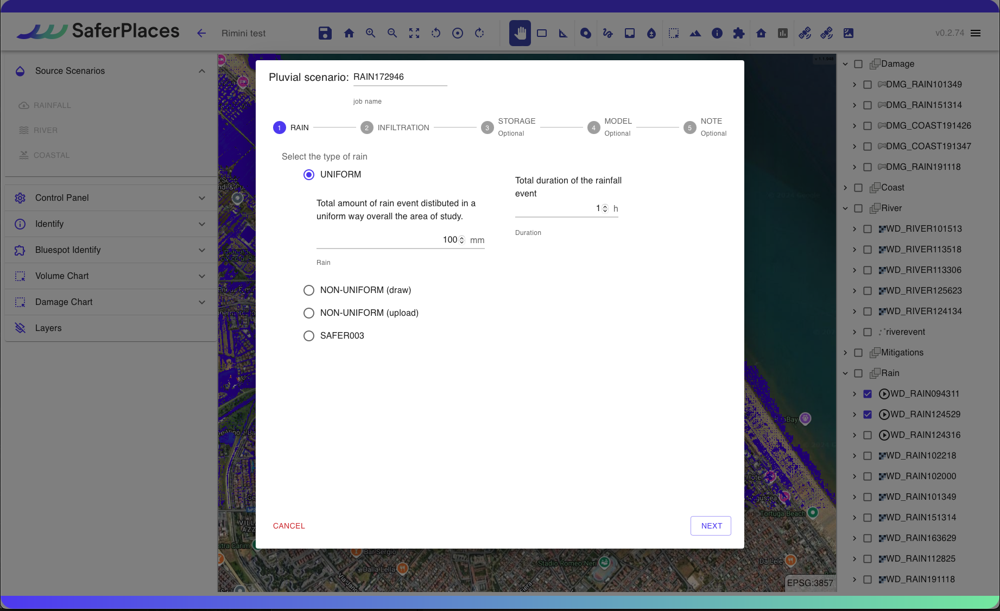
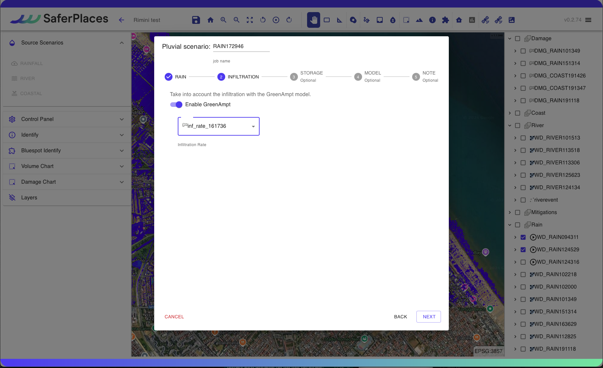
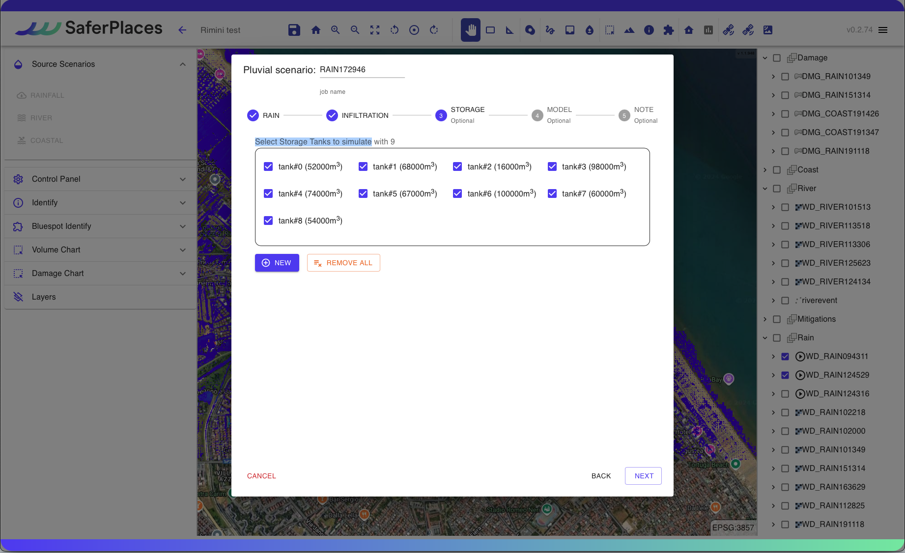
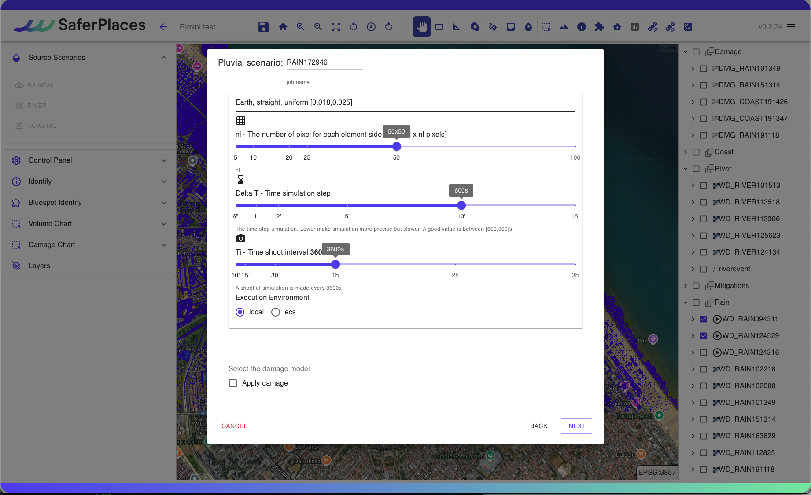
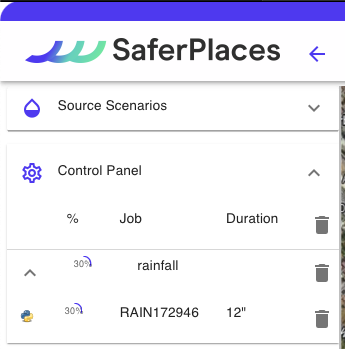

# 🌧️ Simulazione Allagamento Pluviale

In questa sezione si descrive la procedura per l'esecuzione di una simulazione di allagamento di tipo Pluviale, ovvero determinato da un evento meteorico di pioggia intensa e in genere di breve durata che genera una forte criticità nella gestione del deflusso delle acque superficiali con allagamenti in aree urbane particolarmente intensi in zone depresse (sottopassi).

## RAINFALL - SIMULAZIONE ALLAGAMENTO PLUVIALE

Il Wizard offre una procedura guidata dove l'utente definisce i seguenti dati e parametri di input:

Nome Simulazione

L'utente può modificare il nome della simulaizone editando liberamente il nome che viene assegnato automaticamente. Si consiglia di utilizzare un nome composto da caratteri standard e numeri senza uso dello spazio e/o simboli.

Definizione e caratterizzazione  dell'evento Pluviale -“<em>Pluvial scenario</em>” (1-RAIN)

Il primo step 1-RAIN richiede la definizione e caratterizzazione in termini di intensità e durata dell'evento meteorico di pioggia che si intende simulare.

L'utente ha la possibilità di definire l'intensità di pioggia in mm che intende simulare in tre diverse modailità:

1. Evento Pluviale di intensità (mm) UNIFORM su tutta l'area del dominio attivata
2. Evento Pluviale localizzato in una sottoarea con intensità (mm) NON-UNIFORM(draw) associata ad un poligono che disegnato dall'utente attraverso  lo strumento “_Rain_” presente nella [barra-superiore.md](../../saferplaces-interfaccia-gui-web/barra-superiore.md "mention")
3. Evento Pluviale di intensità (mm) NON UNIFORM (upload) caricando un file raster formato GeoTIFF - ad esempio fornito da prodotto RADAR METEO o MODELLO METEO FORECAST
4. Evento Pluviale con intensità (mm) generato dal prodotto satellitare @@@@

L'utente ha la possibilità di definire la durata temporale in ore (h) dell'evento meteo pluviale che intende simulare mediate il box "Total duration of the rainfall event"&#x20;

Modello Infiltrazione del terreno (2-INFILTRATION)

L'utente ha la possibilità di attivare il modulo di infiltrazione nel terreno nell'esecuzione della simulazione.

Il Modulo di infiltrazione è basato sul Modello Green-Ampt ed utilizza come dato di input i layer definiti nello [step-3-tasso-di-infiltrazione-raster-geotiff.md](../../gemello-digitale-e-attivazione-nuovo-servizio/creazione-digital-twin-e-attivazione-del-servizio-nellarea-di-interesse/step-3-tasso-di-infiltrazione-raster-geotiff.md "mention") e [step-4-litologia-raster-geotiff.md](../../gemello-digitale-e-attivazione-nuovo-servizio/creazione-digital-twin-e-attivazione-del-servizio-nellarea-di-interesse/step-4-litologia-raster-geotiff.md "mention")

Vasche di Accumulo (3-STORAGE)

Come misura di mitigazione dell'hazard la piattaforma SaferPlaces consente all'utente di inserire nel dominio di calcolo delle Vasche di Accumulo (Storage Tanks) che permettono di ridurre il volume di acqua che allaga una specifica area o sotto-bacino del dominio oggetto della simulazione.

Gli Storage Tanks possono essere localizzato come elementi puntiformi mediante l'attivazione dello strumento “_Draw storage tank_”, presente sia nel Wizard che nella  [barra-superiore.md](../../saferplaces-interfaccia-gui-web/barra-superiore.md "mention").

Il tool di generazione delle Storage Tank (Vasche di Accumulo) si attiva cliccando sul Pulsante "NEW" e consente di localizzare le vasche e di associare a ciascuna vasca la capacità volumetrica in mc.

Nel riquadro denominato "Select Storage Tanks to simulate" l'utente ha la possibilità di selezionare e/o rimuvere le Vasche di Accumulo presenti nel dominio. Con il Pulsante "REMOVE ALL" si de-selezionano tutte le vasche presenti.

Modello di calcolo (4-MODEL)

In questa sezione del Wizard l'utente ha la possibilità di&#x20;

1. Selezionare il modello di Allagamento (Hazard)
2. Attivare il calcolo del Dannno Economico (Damage)

I modelli di allagamento Pluviale disponibili sono:&#x20;

[safer\_rain.md](../modelli-di-allagamento-hazard-saferplaces/safer\_rain.md "mention") - Modello Raster-based filling and spilling

[untrim.md](../modelli-di-allagamento-hazard-saferplaces/untrim.md "mention") - Modello Idrodinamico 2D

L'opzione di default è sempre il modello [safer\_rain.md](../modelli-di-allagamento-hazard-saferplaces/safer\_rain.md "mention")

Nel caso si selezioni il modello [untrim.md](../modelli-di-allagamento-hazard-saferplaces/untrim.md "mention") occorre definire i seguenti parametri "Settings" cliccando sul task dedicato.&#x20;

* Slider - Durata della Simulazione in ore (h) -Tmax - Max time of simulation
* Slider - Coefficiente di scabrezza Manning  -Manning Coefficient
* Slider - Cella di calcolo in numero di pixel -nl - The number of pixel for each element side&#x20;
* Slider - Tempo di integrazione numerico  (min) -Delta T - Time simulation step
* Slider - Frequenza Stampa Output  (min) -Ti - Time shoot interval

L'attivazione del modello di calcolo del Danno Economico procede spuntando il check-box "Apply Damage"

Definizione dei parametri del modello di calcolo

&#x20;Modello Saferplaces\
\

.png>)

.png>)

Modello UNTRIM

Attivazione Calcolo del danno economico - DAMAGE

Nella procedura guidata alla pagina "Model" è possibile attivare il calcolo del danno economico per ciascun edificio inserito.

Il calcolo del Danno Economico viene eseguito in prima analisi applicando le seguenti ipotesi:

1. Tutti gli edifici cono considerati residenziali con un curva di vulnerabilità residenziale
2.  Valore dell'edificio pari a 1000 euro/mq\

    <figure><figcaption></figcaption></figure>

Inserimento metadati e descrizione della  simulazione generata (5- NOTE)

Cliccando sul pulsante EDIT l'utente può attivare una casella di testo dove inserire metadati e dettagli descrittivi della simulazione che ha appena creato.

RUN SIMULAZIONE

Cliccando sul pulsante RUN l'utente attiva l'esecuzione della simulazione creata.\
Dopo l'avvio sul pannello Control Panel si aggiungerà l'esecuzione del processo attivato con indicazione dello stato di avanzamento.

## Esempio di simulazione pluviale pioggia uniforme con SAFER



## Esempio di simulazione pluviale pioggia non uniforme con SAFER



## Esempio di simulazione pluviale con Storage Tank



## Esempio di simulazione pluviale con Modifica Infiltrazione


