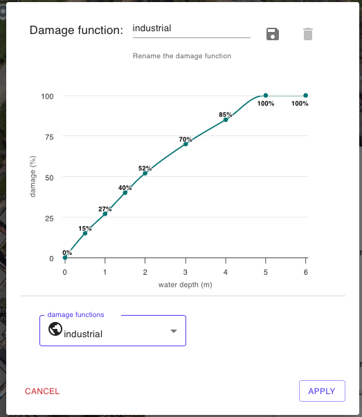

# 🏚️ Modello di Danno Economico - Safer\_DAMAGE

Il modello Safer\_DAMAGE calcola il danno economico per ciascun edificio utilizzando come dati di input i seguenti:

* Superficie Areale della sagama dell'edificio (footprint)- calocato dalla geometria dello shapefile
* Valore al mq in euro/usd dell'edificio
* Valore della Water Depth (altezza d'acqua) Media per i pixel non nulli all'interno di un buffer di 2m
* Curva di Danno o Vulnerabilità (Damage Function) definita dall'utente mediante in tool [#strumento-curve-di-danno-e-valore-edifici](../saferplaces-interfaccia-gui-web/barra-superiore.md#strumento-curve-di-danno-e-valore-edifici "mention")

<figure><figcaption></figcaption></figure>

\

Bibliografia modello Safer_DAMAGE

@aggiornare per tutti i modelli

